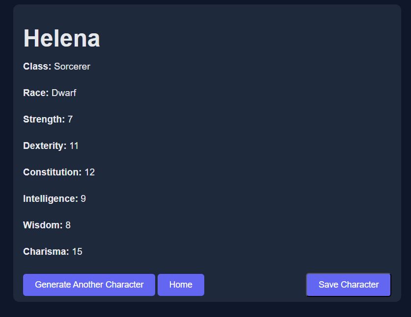

# Random Character Generator


A Django web application that generates randomized tabletop RPG characters with optional persistence. Users can save and organize a list of generated characters.


## Overview


A tabletop roleplaying experience is marked by delicate planning and organization. However, in certain circumstances, situations arise that could never have been planned for. In those instances, better to randomly generate an NPC than to imply a lack of preparation.

This web application presents a simple, yet cleanly organized program for generating and saving characters, complete with stats.

## Tech Stack


* Python
* Django
* HTML
* CSS
* JavaScript
* SQLite (Django default)

## How It Works


* Characters are generated in memory and displayed immediately.
* A character is only saved in the database if the user clicks the save action after generation.
* Saved characters are displayed in an archive view.
* Character archives are rendered as collapsible cards to streamline organization.

## Setup & Usage


### Prerequisites
* Python 3.13.3
* Django

### Run Locally

```bash```

```python manage.py migrate```

```python manage.py runserver```

Navigate to localhost

## Demo


## Author
Richard Hamilton